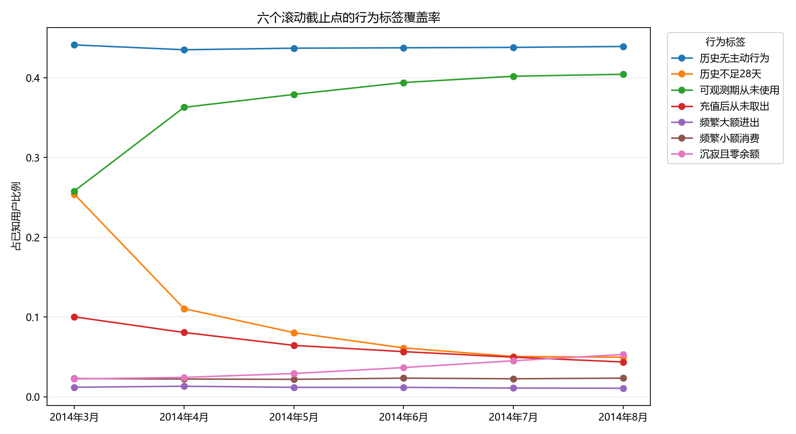
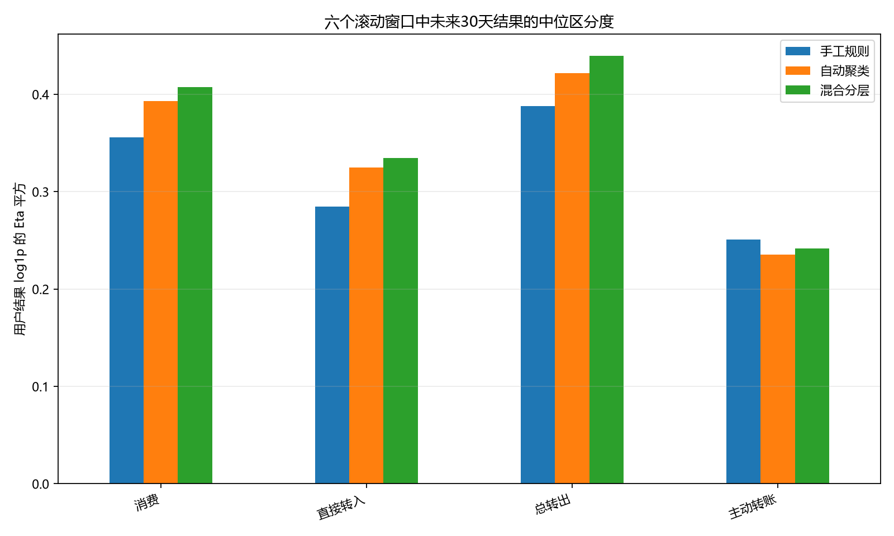

# 用户行为分层研究报告

## 核心结论

用户行为分层这条路线成立，但建议采用**混合分层**，而不是在纯手工规则和纯自动聚类之间二选一。

- 手工规则先识别历史不足、可观测期从未使用、充值后从未取出、沉寂且零余额等生命周期状态。这些状态有明确含义，否则会主导距离型聚类。
- 自动聚类只用于其余活跃用户，探索余额、金额、频率、资金方向和消费结构等难以手工穷举的组合。
- 六个无泄漏窗口选出的簇数为：3类出现在1个窗口、4类出现在3个窗口、5类出现在2个窗口。所选模型不同初始化之间的 ARI 为 0.452–1.000，其中8月只有 0.452，因此自动簇只能视为滚动行为风格，不能视为永久用户身份。
- 相邻月份 ARI 中位数为：手工规则 0.681、自动聚类 0.686、混合分层 0.641。混合分层对直接转入、总转出和消费的区分度最高；主动转账则是手工规则略强，没有一种方法在所有目标上都胜出。
- 未来窗口内活跃用户中的新用户占比中位数为 11.4%。真正的新用户在首次交易前没有历史行为，仍需单独处理冷启动。

## 四类行为在本数据中的定义

官方数据没有单独的开户事件。因此，“开通后没用过”只能保守定义为：至少已观测28天、历史主动资金流为零、历史最高余额也为零。历史不足28天的用户单列为“历史不足”，避免把冷启动误判成长期未使用。“充值后一直没取”要求历史上发生过直接转入、没有任何转出，且当前余额为正。

“频繁大额进出”和“频繁小额消费”使用各截止点之前的数据动态计算阈值。大额和高频依据历史90天人群分位数；小额消费依据截止点前非零消费日金额中位数。所有标签和阈值均不使用未来30天结果。

| 行为标签 | 覆盖率中位数(%) | 最低覆盖率(%) | 最高覆盖率(%) | 未来转入活跃率倍数 | 未来转出活跃率倍数 |
| --- | --- | --- | --- | --- | --- |
| 历史无主动行为 | 43.79 | 43.52 | 44.13 | 0.16 | 0.09 |
| 可观测期从未使用 | 38.66 | 25.80 | 40.44 | 0.15 | 0.08 |
| 转账导向 | 17.65 | 15.96 | 19.56 | 1.91 | 1.85 |
| 消费导向 | 14.59 | 13.95 | 15.61 | 1.66 | 2.01 |
| 低周转持有 | 9.92 | 9.15 | 12.36 | 0.62 | 0.69 |
| 历史不足28天 | 7.08 | 4.95 | 25.40 | 0.68 | 0.57 |
| 充值后从未取出 | 6.05 | 4.36 | 10.02 | 1.14 | 1.07 |
| 沉寂且零余额 | 3.28 | 2.23 | 5.30 | 0.30 | 0.18 |
| 频繁小额消费 | 2.27 | 2.18 | 2.33 | 2.57 | 3.07 |
| 频繁大额进出 | 1.18 | 1.06 | 1.32 | 3.47 | 3.24 |
| 仅有被动余额 | 0.02 | 0.01 | 0.03 | 0.00 | 0.00 |

## 8月截止点的手工分层

下表描述8月测试窗开始前已经出现的用户。未来资金量占比只用于评价标签是否有区分能力，不参与标签分配。

| 用户层 | 用户数 | 用户占比(%) | 未来转入活跃率(%) | 未来转出活跃率(%) | 未来直接转入量占比(%) | 未来总转出量占比(%) |
| --- | --- | --- | --- | --- | --- | --- |
| 可观测期从未使用 | 10751 | 40.44 | 2.82 | 1.89 | 1.40 | 0.51 |
| 转账导向 | 3801 | 14.30 | 44.59 | 50.43 | 36.06 | 35.71 |
| 消费导向 | 3135 | 11.79 | 35.82 | 52.25 | 12.05 | 13.97 |
| 低周转持有 | 2327 | 8.75 | 8.12 | 9.54 | 1.55 | 1.29 |
| 均衡或其他活跃 | 1415 | 5.32 | 70.67 | 79.29 | 15.36 | 14.23 |
| 沉寂且零余额 | 1410 | 5.30 | 4.89 | 3.26 | 0.43 | 0.19 |
| 历史不足28天 | 1317 | 4.95 | 12.98 | 12.91 | 1.40 | 0.59 |
| 充值后从未取出 | 1026 | 3.86 | 20.27 | 22.81 | 2.33 | 2.59 |
| 频繁小额消费 | 618 | 2.32 | 67.64 | 86.25 | 2.64 | 2.24 |
| 频繁大额进出 | 283 | 1.06 | 83.04 | 90.46 | 21.83 | 22.39 |
| 净转入导向 | 257 | 0.97 | 62.26 | 66.54 | 3.45 | 4.57 |
| 净转出导向 | 241 | 0.91 | 40.25 | 61.83 | 1.49 | 1.72 |
| 仅有被动余额 | 3 | 0.01 | 0.00 | 0.00 | 0.00 | 0.00 |

## 手工、自动与混合分层的区分度

Eta平方衡量用户层级的分组能够区分多少未来30天对数结果差异。它只是关联诊断，不代表因果关系，也不等同于真实预测模型的分数提升。

| 分层方法 | 未来目标 | Eta平方中位数 | 最低值 | 最高值 |
| --- | --- | --- | --- | --- |
| 自动聚类 | 消费 | 0.393 | 0.364 | 0.408 |
| 自动聚类 | 直接转入 | 0.325 | 0.247 | 0.336 |
| 自动聚类 | 总转出 | 0.422 | 0.376 | 0.429 |
| 自动聚类 | 主动转账 | 0.236 | 0.211 | 0.241 |
| 混合分层 | 消费 | 0.407 | 0.369 | 0.424 |
| 混合分层 | 直接转入 | 0.335 | 0.253 | 0.345 |
| 混合分层 | 总转出 | 0.440 | 0.386 | 0.445 |
| 混合分层 | 主动转账 | 0.242 | 0.217 | 0.252 |
| 手工规则 | 消费 | 0.356 | 0.312 | 0.381 |
| 手工规则 | 直接转入 | 0.285 | 0.213 | 0.322 |
| 手工规则 | 总转出 | 0.388 | 0.327 | 0.417 |
| 手工规则 | 主动转账 | 0.251 | 0.223 | 0.265 |

## 建议的建模方式

1. 生命周期和状态规则保留为多个独立标签，不要为了展示方便而强制压成一个互斥类别。
2. 只对历史充足的活跃用户聚类；金额先做对数变换，再稳健标准化。每个滚动折都重新拟合缩放参数和聚类中心。
3. 将规则标签和聚类结果聚合成日级特征：各层用户数、活跃用户数、余额、滞后转入转出、近期分层迁移量。
4. 按“基础时序模型→增加手工标签→增加活跃用户聚类→增加状态迁移”依次做消融。只有滚动分数中位数提升且最差窗口没有明显退化时才保留。
5. 新用户使用到达人数和早期生命周期行为单独建模，因为预测时无法获得完整历史分层。

## 建议补充的行为维度

- 生命周期：新出现、刚完成首次充值、成熟、沉寂、重新激活。
- 资金方向：净转入、净转出、双向均衡周转。
- 资金用途：主动转账导向、消费导向。
- 价值与集中度：高余额、高资金周转、一次性大额、少数日期贡献大部分金额。
- 时间偏好：工作日或周末、月初或月末、固定日期周期、行为最近发生时间。
- 渠道偏好：银行卡转入或余额转入、转银行卡或转余额。

## 结论边界

本研究覆盖2014年3月至8月六个滚动窗口，只使用各截止点之前的行为构造标签，并用随后30天评价区分度。当前结果不说明聚类与交易存在因果关系，也尚未证明能够提高比赛分数。下一道验收关是把这些分层放进真实预测流程，执行无泄漏的六折消融测试。
